  

  

    <a href="https://donvangrobler.github.io/">Website</a> ·
    <a href="https://donvangrobler.github.io/writing/">Writing</a> ·
    <a href="https://github.com/DonvanGrobler?tab=repositories">Repositories</a>
  

### Hello, I'm Donvan Grobler 👋

I'm an Earth observation project lead based in Innsbruck, Austria. I work across operational EO services, product development, and applied AI, moving between people's questions, technical teams, and hands-on prototypes.

I'm particularly interested in the last mile of EO: turning pixels and models into evidence people can understand and act on. That interest runs through my work on accessible EO tools, scaling platforms, and the verification of synthetic geospatial imagery. I [write about](https://donvangrobler.github.io/writing/) how we can start with the decisions people need to make and work backwards to the data and technology.

### Selected work

| Project | What it does |
| --- | --- |
| [EO Image Check](https://github.com/DonvanGrobler/AI4EO-detector) · [live prototype](https://ai4eo-detector.onrender.com/) | Helps investigate broad claims about satellite or map screenshots using independent Sentinel-2 observations. An experimental tool with explicit limits on what the imagery can verify. |
| [LULC Change Buffer Zones](https://github.com/DonvanGrobler/LULC_change_buffer_zones) | Explores land-cover change around South African national parks with Dynamic World and Google Earth Engine. |
| [Personal website](https://github.com/DonvanGrobler/donvangrobler.github.io) · [visit](https://donvangrobler.github.io/) | My writing and projects, built with Astro. |
